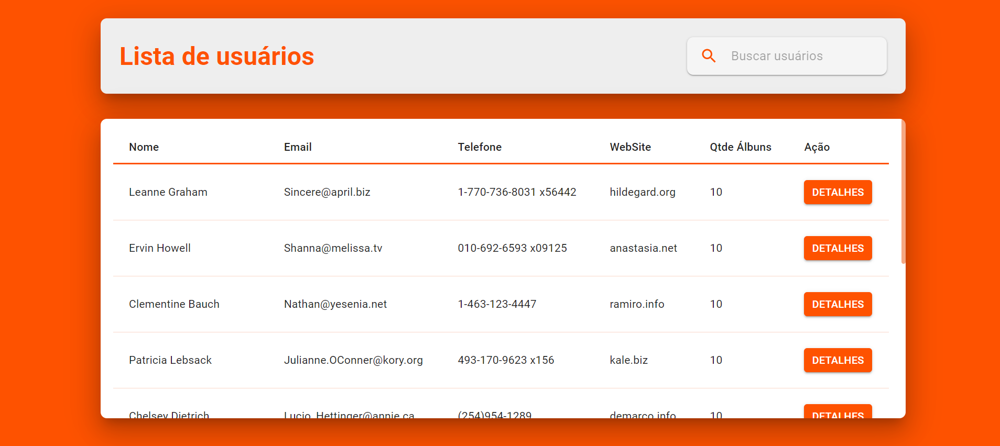
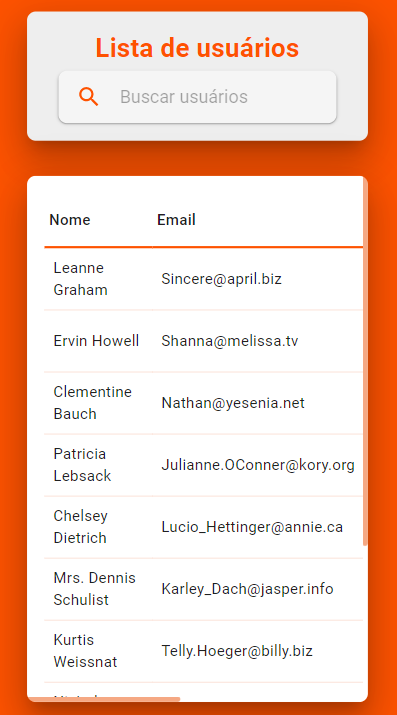
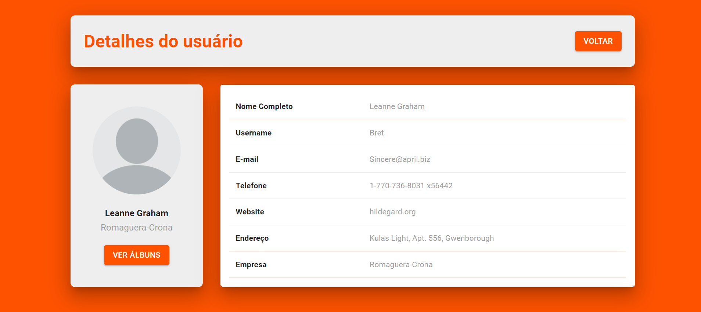
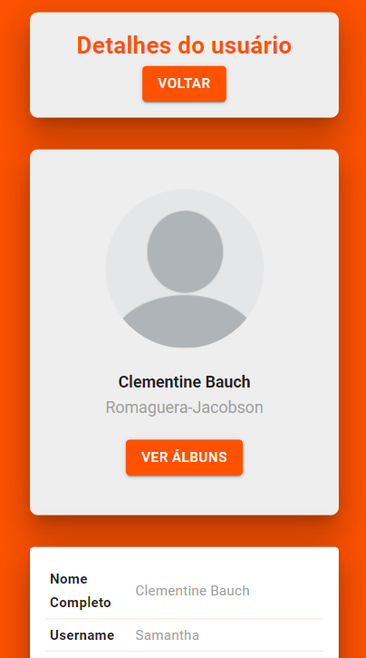
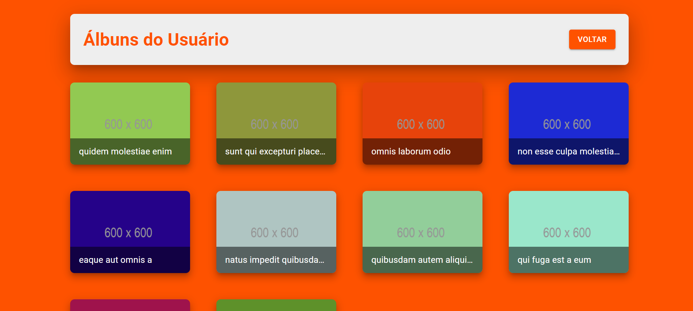
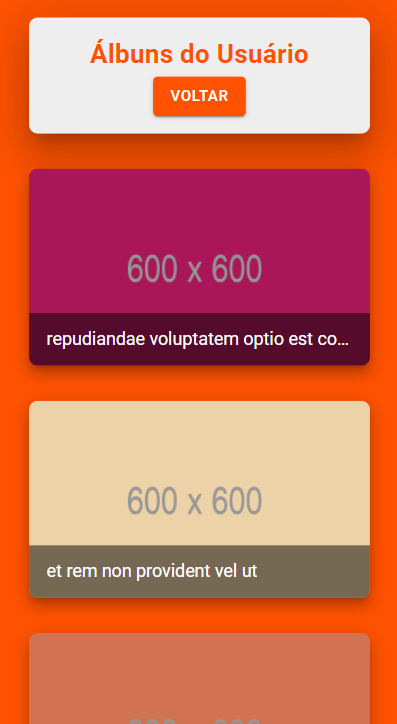
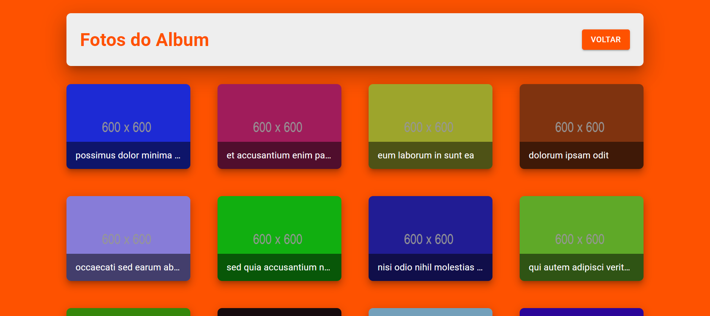
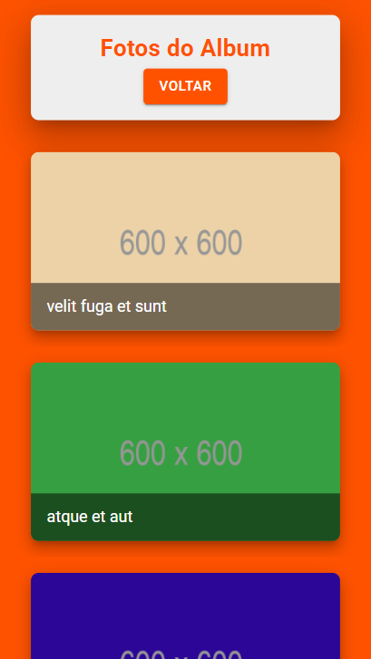

<h1 align="center">Processo Seletivo Front end - Delivery Center</h1>

<p align="center"><b>Status: Em construção 🚧</b></p>

## <a id="sobre"></a> ℹ Sobre

🚀 A aplicação consiste em um desafio desenvolvido para a vaga de Desenvolvedor Front-End da empresa Delivery Center cujo propósito está na refatoração de um projeto MVP fictício que lista usuários e álbuns de fotos. É possível consultar o resultado [aqui](https://dc-front-devtest.herokuapp.com/).

## <a id="conteudo"></a> Tabela de conteúdos

- [Sobre](#sobre)
- [Tabela de Conteudo](#conteudo)
- [Tecnologias](#tecnologias)
- [Tarefas](#tarefas)
- [Demonstração](#demonstracao)
- [Documentação](#documentacao)
- [Como Executar](#executar)

## <a id="tecnologias"></a> 🛠 Principais tecnologias

As seguintes tecnologias foram utilizadas na construção deste projeto:

- [React](https://pt-br.reactjs.org/)
- [Typescript](https://www.typescriptlang.org/)
- [Storybook](https://storybook.js.org/)
- [Chromatic](https://www.chromatic.com/)
- [Material-UI](https://material-ui.com/pt/)
- [JEST](https://jestjs.io/pt-BR/)
- [Testing Library](https://testing-library.com/)

## <a id="tarefas"></a> 🔝 Tarefas

- [x] Corrigir funcionamento do app.
- [x] Melhorar a estrutura do código.
- [x] Melhorar estrutura de comunicação com API.
- [x] Mover telas do projeto para suas respectivas rotas.
- [x] Redesign da aplicação
- [x] Melhorar acessibilidade
- [x] Testes Unitários - componentes
- [ ] Testes Unitários - páginas
- [ ] Testes de Integração
- [x] Gerenciamento de estado por contexto
- [ ] Teste end-to-end
- [ ] Cache na aplicação

## <a id="demonstracao"> </a> ✅ Demonstração da aplicação

### Tela de lista de usuários

- Versão Web <br/><br/>
  
  <br/>
- Versão Mobile <br/><br/>
  

### Tela de detalhe do usuário

- Versão Web <br/><br/>
  
  <br/>
- Versão Mobile <br/><br/>
  

### Tela de álbuns do usuário

- Versão Web <br/><br/>
  
  <br/>
- Versão Mobile <br/><br/>
  

### Tela de detalhe do álbum

- Versão Web <br/><br/>
  
  <br/>
- Versão Mobile <br/><br/>
  

## <a id="documentacao"></a> 📄 Documentação

### Storybook

A documentação dos componentes do projeto é feita através do storybook. Para rodar localmente e poder visualizá-la, basta seguir os seguintes passos definidos para [executar o projeto](#executar)

### Chromatic

Além disso, a documentação também está publicada através do [Chromatic](https://www.chromatic.com/), uma ferramenta que facilita o trabalho colaborativo através da automatização da coleta de feedbacks sobre a UI, teste visual e consulta à documentação, permitindo uma interação mais rápida e com menos trabalho manual.

Para acessar a documentação do Chromatic, basta realizar o login e selecionar o projeto. Todos os colaboradores desse repositório também possuem acesso a esta ferramenta. Outra opção é acessar a aplicação através deste [invite para a biblioteca de componentes](https://chromatic.com/library?appId=611eafce2a53eb003a4bc7a8&branch=app-refactor), [lista de builds](https://www.chromatic.com/builds?appId=611eafce2a53eb003a4bc7a8&branch=app-refactor) ou através do [link para o Storybook](https://app-refactor--611eafce2a53eb003a4bc7a8.chromatic.com).

## 🚀 <a id="executar"></a> Como executar o projeto

### Pré-requisitos

Antes de começar, você vai precisar ter instalado em sua máquina as seguintes ferramentas:
[Git](https://git-scm.com), [Node.js](https://nodejs.org/en/).
Além disto é bom ter um editor para trabalhar com o código como [VSCode](https://code.visualstudio.com/)

### 🧭 Rodando a aplicação, documentação e testes

```bash
# Clone este repositório
$ git clone https://github.com/brunaschneiders/dc.front.devtest.git

# Acesse a pasta do projeto no seu terminal/cmd
$ cd dc.front.devtest

# Instale as dependências
$ yarn install

# Execute a aplicação em modo de desenvolvimento
$ yarn start

# A aplicação será aberta na porta:3000 - acesse http://localhost:3000

# Para executar a documentação em modo de desenvolvimento:
$ yarn storybook

# A Documentação será aberta na porta:6006 - acesse http://localhost:6006

# Para executar os testes:
$ yarn test
```

## Autor

👤 **Bruna Schneiders**

- Github: [@brunaschneiders](https://github.com/brunaschneiders)
- LinkedIn: [@bruna-schneiders](https://linkedin.com/in/bruna-schneiders)
